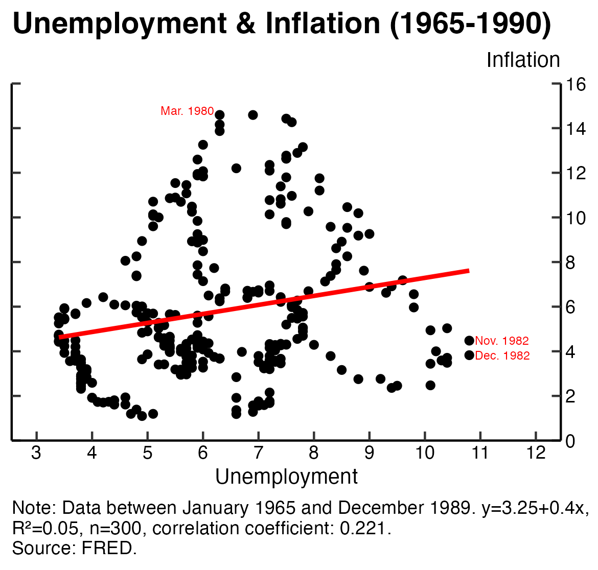
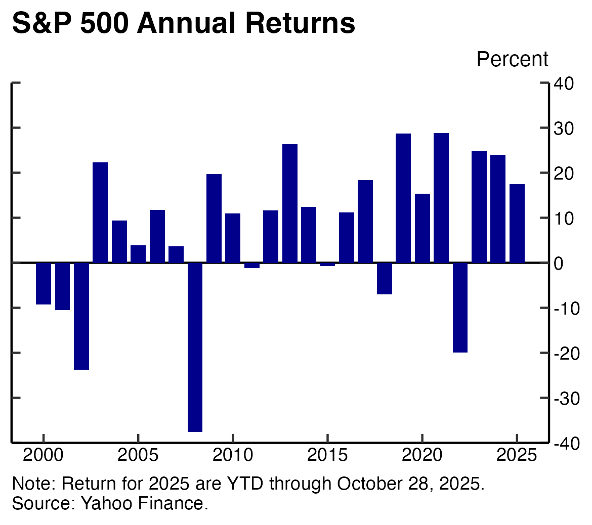

# Economic Charting
The following chart types/topics are covered:
- Line graphs - using unemployment and inflation data;
- Bar chart - using stock returns;
- Stacked bar chart - using U.S. trade data;
- Dumbell plot - using U.S. demographic data.

## Macroeconomic indicators

Below are the [Consumer Price Index for All Urban Consumers](https://fred.stlouisfed.org/graph/?g=1wmdD) (CPI) and the [Unemployment Rate](https://fred.stlouisfed.org/series/UNRATE) from FRED via the `quantmod` library.

<!--  -->
<p align="center">

</p>

The left and right dashed lines are the Fed's target for year-over-year (YoY), or annual, inflation and the "natural rate of unemployment", respectively. The inflation target is plotted at the Fed's stated two percent target. Although the exact figure for the "natural rate of unemployment" is unkown - it usually hovers between four and five percent; Above, I plotted it at five percent.

When plotted together, the unemployment rate and inflation seem to have an inverse relationship. When unemployment goes up inflation comes down.

<!--  -->
<p align="center">

</p>

To better observe this inverse relationship, we need to plot the two series in a scatter plot.

## Phillips curve

When plotted across time, we see that unemployment and inflation are indeed negatively correlated with a correlation coefficient of -0.433. This relationship is described by [the Phillips curve](https://en.wikipedia.org/wiki/Phillips_curve). 

In our sample, from 2000-present, we see that the highest data point for inflation is from June 2022 and our highest data point for unemployment is from April 2020.

<!--  -->
<p align="center">

</p>

The blue line fits a linear model where we regress inflation on the unemployment rate. We can see that there is a significant amount of variation in inflation for a given level of unemployment. This tell us that there are other factors missing from our model which affect inflation.

In fact, there is a considerable amount of debate about the usefulness of the Phillips curve since there are many examples where it doesn't hold. If we plot inflation and unemployment data from the 25 years between 1965 and 1990, we see that the relationship turns positive.

<p align="center">

</p>

Today, most economists agree that the Phillips curve is only unseful in the short run, and that in the long run there is no trade-off in inflation and unemployment.

## Pandemic effects
The negative shock in the demand for labor causing a spike in unemployment, and later, the negative shock to the supply of goods and services cuasing higher inflation have largely worked their way through the economy. 

At its very worst, the unemployment rate was over 400%, or over 4x, its pre-pandemic level. Similarly, the CPI at its very highest was increasing at a rate just under 4x its pre-pandemic pace.

<p align="center">

</p>

Measures of both inflation and unemployment have returned to near pre-pandemic levels. Although inflation still hovers above the two percent target.

## Stock market

<p align="center">

</p>

# Github commands
To copy
```
git clone [link]
```
To upload
```
git status
git add .
git commit -m "message"
git push origin main
```

# Markdown features
> [!NOTE]
> Useful information that users should know, even when skimming content.

> [!TIP]
> Helpful advice for doing things better or more easily.

> [!IMPORTANT]
> Key information users need to know to achieve their goal.

> [!WARNING]
> Urgent info that needs immediate user attention to avoid problems.

> [!CAUTION]
> Advises about risks or negative outcomes of certain actions.
