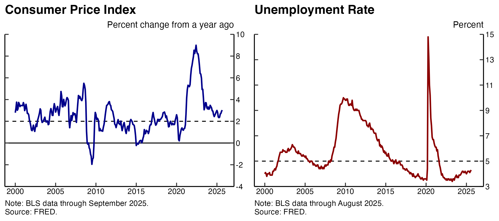

# Economic Charting
The following chart types/topics are covered:
- Line graphs - using unemployment and inflation data;
- Bar chart - using stock returns;
- Stacked bar chart - using U.S. trade data;
- Dumbell plot - using U.S. demographic data.

## Plot #1

I will be plotting the [Consumer Price Index for All Urban Consumers](https://fred.stlouisfed.org/graph/?g=1wmdD) and the [Unemployment Rate](https://fred.stlouisfed.org/series/UNRATE) from FRED via the `quantmod` library.

<!--  -->
<br />

## Phillips curve

The solid lines below show the percent change from a year ago in the consumer price index (CPI) and the unemployment rate. The dashed red and blue lines are the "natural rate of unemployment" and the Fed's target for annual inflation, respectively. 

Although the exact figure for the "natural rate of unemployment" is unkown - it usually hovers between four and five percent; Below, I plotted it at five percent. The inflation target is plotted at the stated two percent.

<!--  -->
<p align="center">

</p>

The two varibales seem to have in an inverse relationship - when unemployment is up inflation is down. This negative correlation (-0.433) is described by [the Phillips curve](https://en.wikipedia.org/wiki/Phillips_curve#/media/File:U.S._Phillips_Curve_2000_to_2013.png). However, if we plot the two variables aginst eachother, we see that the relationship is imperfect. There are other, here unobserved, factors that affect inflation.


# Github Commands
To copy:
```
git clone [link]
```
To upload
```
git status
git add .
git commit -m "message"
git push origin main
```
> [!NOTE]
> Useful information that users should know, even when skimming content.

> [!TIP]
> Helpful advice for doing things better or more easily.

> [!IMPORTANT]
> Key information users need to know to achieve their goal.

> [!WARNING]
> Urgent info that needs immediate user attention to avoid problems.

> [!CAUTION]
> Advises about risks or negative outcomes of certain actions.
